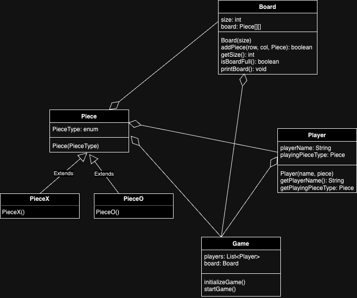

# Design of Tic Tac Toe game

This is a low level design of tic tac toe game in java.

##Assumptions
For simplification we have used two person and size of the board to be 3.
Any symbol can be used for playing

## Project Structure

The project is organized as follows:

Strategy_Pattern/<br>
|-- Main.java [Main Class]<br>
|-- Game.java<br>
|-- Model/<br>
| |-- Board.java<br>
| |-- Piece.java<br>
| |-- PieceO.java<br>
| |-- PieceX.java<br>
| |-- Player.java<br>
| |-- PieceType.java [enum] <br>

## Design Pattern used
Have not used any design pattern in this example. But can use a factory design pattern to only use some of the pieces based on user choice. We can create many sub class of pieces of different characters like '$', '#' etc.

## UML diagram


## Link for notes
https://www.notion.so/Design-tic-tac-toe-game-42c993a8203a4290ac00d82029779b82

## Compilation and Execution

To compile and run the project, navigate to the `lld` directory in the terminal and use the following commands:

```bash
javac lld/Tic_Tac_Toe_game/*.java
java lld.Tic_Tac_Toe_game.Main 
